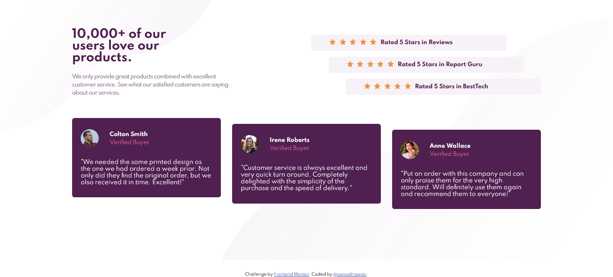

# Frontend Mentor - Social proof section solution

This is a solution to the [Social proof section challenge on Frontend Mentor](https://www.frontendmentor.io/challenges/social-proof-section-6e0qTv_bA). Frontend Mentor challenges help you improve your coding skills by building realistic projects.

## Table of contents

- [Overview](#overview)
  - [Screenshot](#screenshot)
  - [The challenge](#the-challenge)
  - [Links](#links)
- [My process](#my-process)
  - [Built with](#built-with)
  - [What I learned](#what-i-learned)
- [Contact](#contact)

## Overview

### Screenshot

### The challenge

Users should be able to:

- View the optimal layout for the section depending on their device's screen size

### Links

[Solution URL](https://www.frontendmentor.io/solutions/responsive-mobilefirst-with-sass-2jZntoyx1) |
[Live Site URL](https://samudriawan.github.io/social-proof-section-frontendmentor/) |
[Challenge](https://www.frontendmentor.io/challenges/social-proof-section-6e0qTv_bA)

## My process

### Built with

- Semantic HTML5 markup
- Mobile-first workflow
- [SASS](https://sass-lang.com/) - CSS Preprocessor

### What I learned

CSS Grid practice and get myself comfortable with SASS.

## Contact

- Github - [@samudriawan](https://github.com/samudriawan/)
- Twitter - [@samudriawan](https://twitter.com/samudriawan)
- Frontend Mentor - [@samudriawan](https://www.frontendmentor.io/profile/samudriawan)
